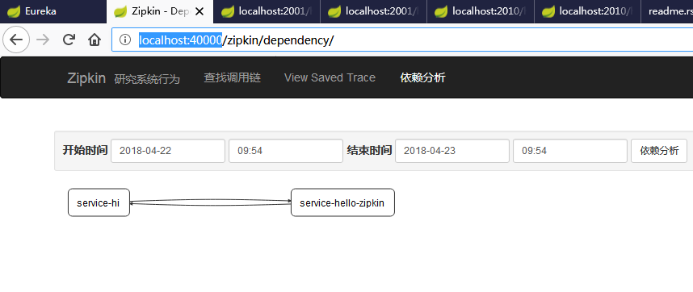

项目简介
===================

简介
    概括springcloud各组件功能

环境信息
    - springboot 1.5.10
    - springcloud Edgware.SR2

项目代码

        源代码_    

注册中心 与 服务提供者
----------------------------
搭建步骤详见 服务注册中心高可用环境搭建_

服务消费者 rest+ribbon
-------------------------

客户端负载均衡

配置中心服务端 config-server
------------------------------

配置中心客户端 config-client
---------------------------------

网关服务 zuul-service
----------------------------

消息总线 spring cloud bus
-------------------------------

改造 config-client

1. pom.xml 中增加依赖

.. code:: java

        <dependency>
            <groupId>org.springframework.cloud</groupId>
            <artifactId>spring-cloud-starter-bus-amqp</artifactId>
        </dependency>

2.  controller 类上增加注解

.. code:: java

    @RefreshScope

没有验证在启动类上增加该注解是否管用

3. 修改配置文件

bootstrap.yml 配置如下

.. code:: java

    spring:
      cloud:
        config:
          profile: dev
          label: master
          name: config-client
          discovery:
            enabled: true
            serviceId: config-server
        bus:
          trace:
            enabled: true
    eureka:
      client:
        serviceUrl:
          defaultZone: http://localhost:8889/eureka

application.yml 配置如下

.. code:: java

    spring:
      application:
        name: config-client
      rabbitmq:
        host: localhost
        port: 5672
        username: guest
        password: guest
    management:
      security:
        enabled: false
    server:
      port: 9010

服务链路追踪 sleuth zipkin
-----------------------------------

- 新建工程 zipkin-server

1. 入口方法增加注解 @EnableZipkinServer

2. pom.xml增加依赖如下

.. code:: java

    <dependencies>
        <dependency>
            <groupId>org.springframework.boot</groupId>
            <artifactId>spring-boot-starter-web</artifactId>
        </dependency>
        <dependency>
            <groupId>org.springframework.cloud</groupId>
            <artifactId>spring-cloud-starter-eureka</artifactId>
        </dependency>

        <dependency>
            <groupId>org.springframework.cloud</groupId>
            <artifactId>spring-cloud-starter-eureka</artifactId>
        </dependency>

        <dependency>
            <groupId>io.zipkin.java</groupId>
            <artifactId>zipkin-server</artifactId>
        </dependency>

        <dependency>
            <groupId>io.zipkin.java</groupId>
            <artifactId>zipkin-autoconfigure-ui</artifactId>
        </dependency>
        
        <dependency>
            <groupId>org.springframework.boot</groupId>
            <artifactId>spring-boot-starter-test</artifactId>
            <scope>test</scope>
        </dependency>
    </dependencies>

3. 配置文件applicatioin.yml如下

.. code:: java

    server:
      port: 40000

详见工程

- 新建工程 service-called

1. 配置文件 application.yml如下

.. code:: java

    server:
      port: 2010

    spring:
      application:
        name: service-hello-zipkin
      zipkin:
        base-url: http://localhost:40000

    eureka:
      client:
        serviceUrl:
          defaultZone: http://localhost:8889/eureka/

2. pom.xml文件如下

.. code:: java

    <dependencies>
            <dependency>
                <groupId>org.springframework.boot</groupId>
                <artifactId>spring-boot-starter-web</artifactId>
            </dependency>

            <dependency>
                <groupId>org.springframework.cloud</groupId>
                <artifactId>spring-cloud-starter-zipkin</artifactId>
            </dependency>
            
            <dependency>
                <groupId>org.springframework.cloud</groupId>
                <artifactId>spring-cloud-starter-eureka</artifactId>
            </dependency>

            <dependency>
                <groupId>org.springframework.boot</groupId>
                <artifactId>spring-boot-starter-test</artifactId>
                <scope>test</scope>
            </dependency>
    </dependencies>

3. controller调用eureka-client服务

    详见工程

- 使用原工程 eureka-client

    配置步骤同 sercice-called

依次启动 eureka-server -> zipkin-server -> eureka-client -> service-called

查看 zipkin 监控页面 http://localhost:40000

启动顺序
---------------

1. eureka-server  查看注册中心是否启动 localhost:8889
#. eureka-client  查看注册中心是否注册有该服务，访问服务 http://localhost:2001/hello/sayhello?name=wenchaofu
#. ribbon-service 查看注册中心首付注册有该服务，访问服务 http://localhost:20000/hi?name=wenchao
#. zuul-service   查看注册中心首付注册有该服务，访问服务 http://localhost:30000/api-a/hi?name=forezp&token=22
#. config-server  查看注册中心首付注册有该服务，使用git
#. config-service 查看注册中心首付注册有该服务，http://localhost:9010/hi?name=wenchaofu
#. spring cloud bus 改造config-client 增加依赖 spring-cloud-starter-bus-amqp 。安装好rabbitMq并启动
   修改git 中的配置文件，刷新 http://localhost:9010/bus/refresh

------

.. _服务注册中心高可用环境搭建: https://fuwenchao.github.io/mydoc/doc_build/microservice/springcloud/springcloud_eureka%E7%8E%AF%E5%A2%83%E6%90%AD%E5%BB%BA.html

.. _源代码: http://www.baidu.com

